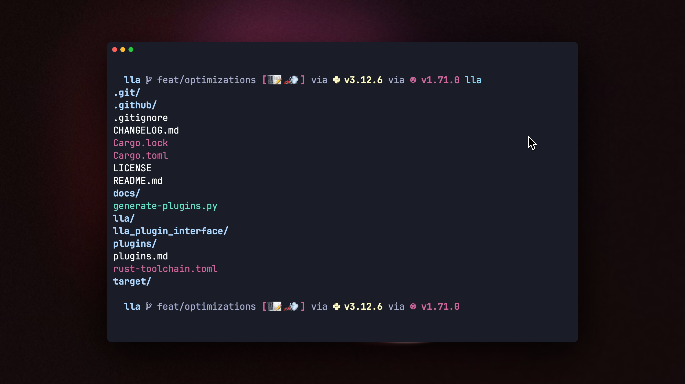
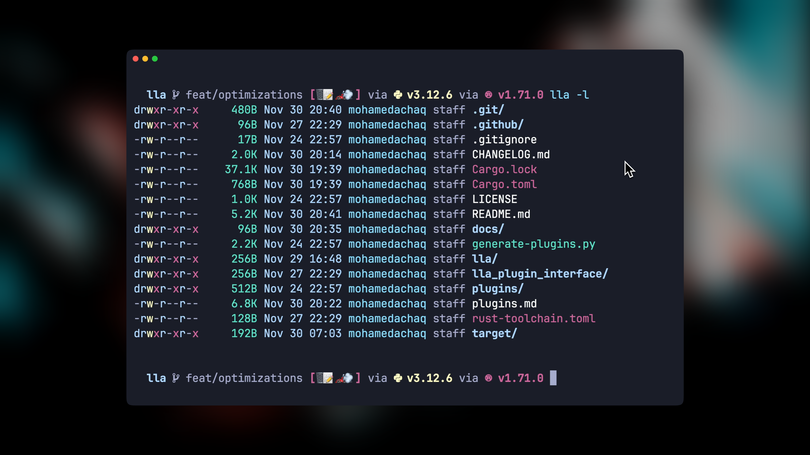
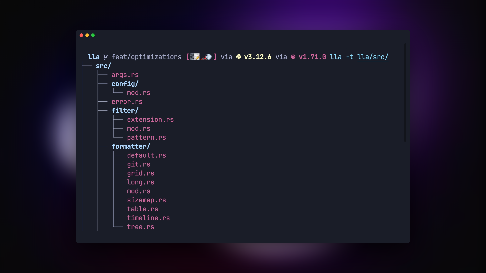
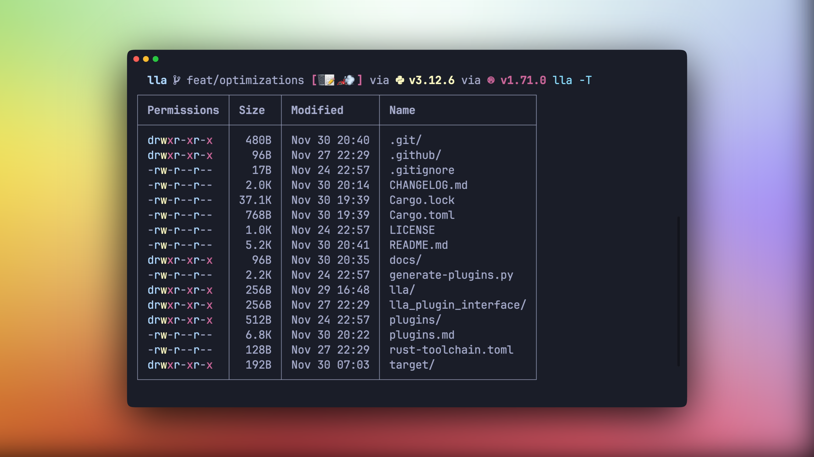
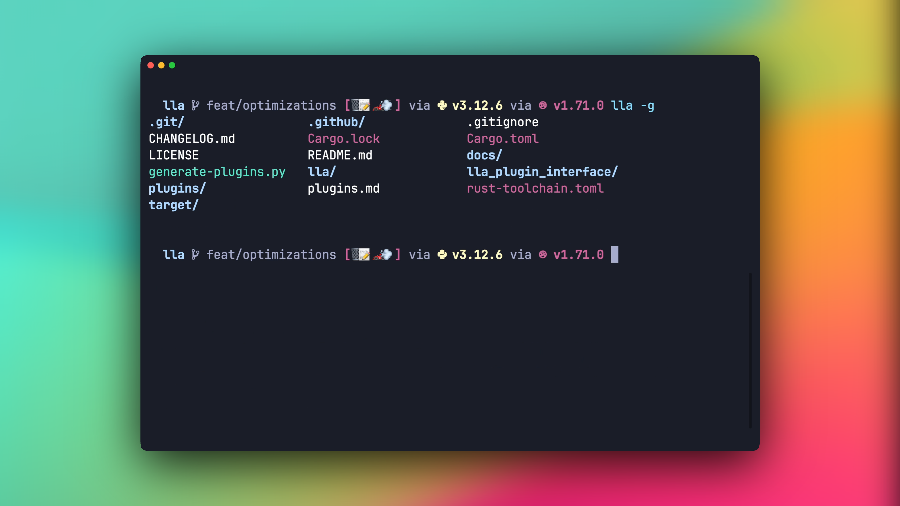
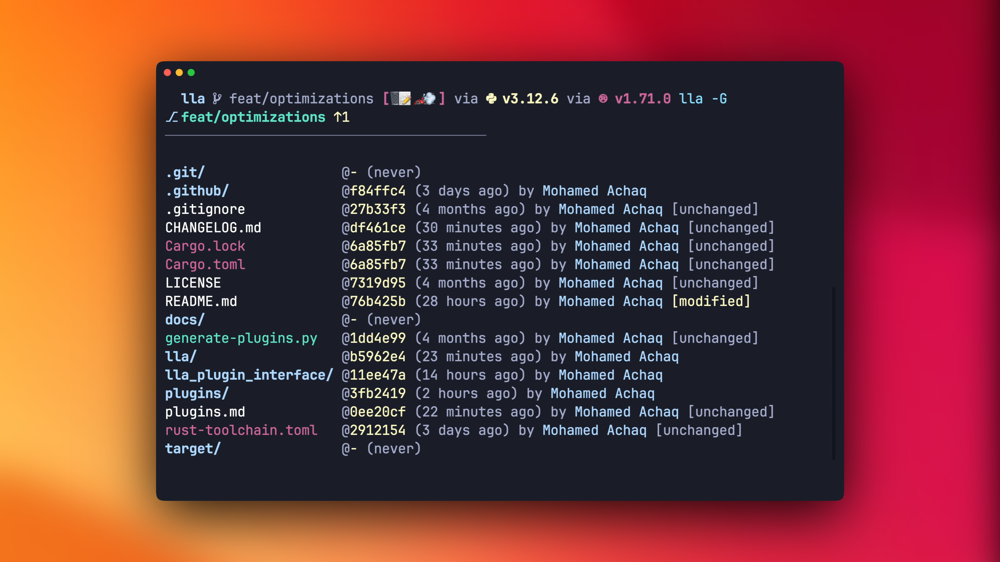
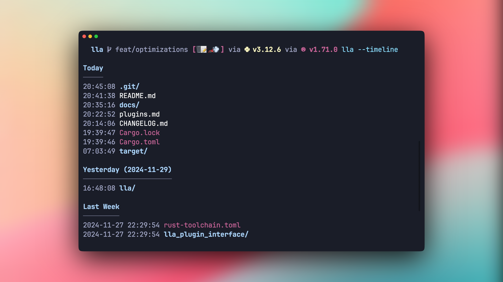

# `lla` - A Modern Alternative to ls

`lla` is a high-performance file explorer written in Rust that enhances the traditional `ls` command with modern features, rich formatting options, and a powerful plugin system.

## Display Formats

### Default View

Quick and clean directory listing

```bash
lla
```



### Long Format

Detailed file information with metadata

```bash
lla -l
```



### Tree View

Hierarchical directory visualization

```bash
lla -t
```



### Table View

Structured data display

```bash
lla -T
```



### Grid View

Organized layout for better readability

```bash
lla -g
```



### Git-Aware View

Repository status and insights

```bash
lla -G
```



### Timeline View

Group files by dates

```bash
lla --timeline
```



## Core Features

- **Smart Display Formats**

  - Default view for quick browsing
  - Long format (`-l`) with detailed metadata
  - Tree view (`-t`) for directory visualization
  - Grid view (`-g`) for organized layouts
  - Table view (`-T`) for structured data
  - Size map (`-S`) for visual space analysis [experimental]
  - Timeline view (`--timeline`) for temporal organization
  - Git-aware view (`-G`) for repository insights

- **Intelligent Organization**

  - Sort by name, size, or date (`-s`)
  - Filter by name or extension (`-f`)
  - Recursive listing with depth control (`-d`)
  - Performance-optimized for large directories

- **Plugin Ecosystem**
  - Git integration for repository insights
  - File categorization and tagging
  - Code complexity analysis
  - Content keyword search
  - File hash calculation
  - Size visualization
  - Duplicate detection
  - Extended metadata display

## Quick Start

1. Install `lla`:

```bash
# Using Cargo
cargo install lla

# On macOS
brew install lla

# On Arch Linux (btw)
paru -S lla

# On NetBSD (we see you)
pkgin install lla
```

2. Initialize your setup:

`lla` uses a TOML configuration file located at `~/.config/lla/config.toml`.

```bash
# Create default config
lla init

# View your config
lla config
```

3. Start exploring:

```bash
# Basic usage
lla                     # List current directory
lla -l                  # Long format with details
lla -t                  # Tree view
lla -g                  # Grid view
lla -T                  # Table view
lla -S                  # Size map view
lla --timeline          # Timeline view
lla -G                  # Git-aware view

# Advanced usage
lla -ls size           # Sort by size in long format
lla -f .rs            # Show only Rust files
lla -t -d 3           # Tree view, max depth 3
```

## Plugin System

<video src="docs/videos/plugins-use.mp4" width="100%" controls></video>

`lla` uses a plugin system to extend its functionality so you can enhance it with custom functionality based on your needs.
You can install plugins from a local directory or from a Git repository.

You can find official plugins [here](https://github.com/triyanox/lla/blob/main/plugins.md).

1. Install plugins:

```bash
# From Git repository
lla install --git https://github.com/user/plugin

# From local directory
lla install --dir path/to/plugin
```

2. Manage plugins:

```bash
# Enable plugins
lla --enable-plugin git_status
lla --enable-plugin keyword_search

# Disable plugins
lla --disable-plugin git_status

# Interactive plugin manager
lla use

# Update plugins
lla update              # Update all plugins
lla update plugin_name  # Update specific plugin
```

3. Plugin actions:

```bash
# Execute plugin actions
lla plugin --name keyword_search --action set-keywords --args "TODO" "FIXME"
lla plugin --name git_status --action show-status
```

## Configuration

Your config lives at `~/.config/lla/config.toml`:

```toml
# Core settings
default_sort = "name"          # name, size, date
default_format = "default"     # default, long, tree, grid
enabled_plugins = ["git_status", "file_hash"]
plugins_dir = "/home/user/.config/lla/plugins"
default_depth = 3

# Performance settings
[formatters.tree]
max_lines = 20000             # Max entries in tree view
[listers.recursive]
max_entries = 20000           # Max entries in recursive listing
```

Modify settings via CLI:

```bash
lla config --set default_sort size
lla config --set default_format long
lla config --set plugins_dir /custom/path
lla config --set default_depth 5
```

## Plugin Development

Develop custom plugins to extend `lla`'s functionality. Plugins are dynamic libraries that implement the `Plugin` trait from the [lla_plugin_interface](https://github.com/triyanox/lla/tree/main/lla_plugin_interface) crate.

1. Create a new plugin:

```bash
cargo new --lib my_lla_plugin
```

2. Configure `Cargo.toml`:

```toml
[package]
name = "my_plugin"
version = "0.1.0"
edition = "2021"

[dependencies]
lla_plugin_interface = "*"

[lib]
crate-type = ["cdylib"]
```

3. Implement the plugin interface:

```rust
use lla_plugin_interface::{Plugin, DecoratedEntry, EntryDecorator, CliArg};

pub struct MyPlugin;

impl Plugin for MyPlugin {
    fn name(&self) -> &'static str {
        "my_plugin"
    }

    fn version(&self) -> &'static str {
        env!("CARGO_PKG_VERSION")
    }

    fn description(&self) -> &'static str {
        env!("CARGO_PKG_DESCRIPTION")
    }

    fn cli_args(&self) -> Vec<CliArg> {
        vec![
            CliArg {
                name: "my-option".to_string(),
                short: Some('m'),
                long: Some("my-option".to_string()),
                help: "Description of my option".to_string(),
                takes_value: true,
            }
        ]
    }

    fn handle_cli_args(&self, args: &[String]) {
        // Handle CLI arguments passed to the plugin
    }

    fn perform_action(&self, action: &str, args: &[String]) -> Result<(), String> {
        match action {
            "my-action" => {
                // Perform custom action
                Ok(())
            }
            _ => Err(format!("Unknown action: {}", action)),
        }
    }
}

impl EntryDecorator for MyPlugin {
    fn decorate(&self, entry: &mut DecoratedEntry) {
        // Add custom fields or modify entry
    }

    fn format_field(&self, entry: &DecoratedEntry, format: &str) -> Option<String> {
        // Return formatted string for display
    }

    fn supported_formats(&self) -> Vec<&'static str> {
        vec!["default", "long", "tree"]
    }
}

lla_plugin_interface::declare_plugin!(MyPlugin);
```

4. Build your plugin:

```bash
cargo build --release
```

5. Install your plugin:

```bash
lla install --dir path/to/plugin
```

or

```bash
lla install --git https://github.com/user/plugin
```

### Plugin Interface

The [lla_plugin_interface](https://github.com/triyanox/lla/tree/main/lla_plugin_interface) crate provides the following key components:

- `Plugin` trait: Core interface for plugin functionality
- `EntryDecorator` trait: Methods for decorating and formatting file entries
- `DecoratedEntry` struct: Represents a file entry with metadata and custom fields
- `CliArg` struct: Defines command-line arguments for the plugin

## Contributing

Contributions are welcome! Please feel free to submit pull requests, report bugs, and suggest features.

1. Fork the repository
2. Create your feature branch (git checkout -b feature/new-feature)
3. Commit your changes (git commit -m 'Add some new-feature')
4. Push to the branch (git push origin feature/new-feature)
5. Open a Pull Request

## License

This project is licensed under the MIT License - see the [LICENSE](LICENSE) file for details.
